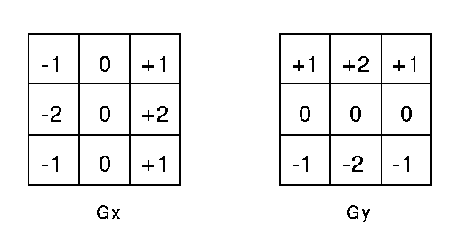
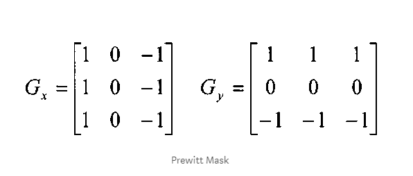
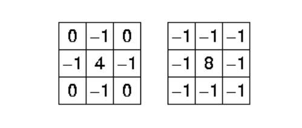
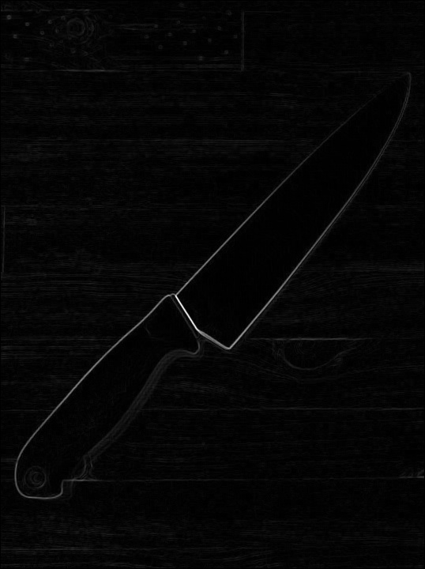

## Edge Detection Using Sobel,Prewitt and Laplacian Operator

### What is an Edge?
Area where there are extreme differences in the intensities of the pixel usually indicate an edge of an object.

### Types Of Edges
These are the main types of ideal edges present in images. The way that the image intensity changes in an image determines the type of edge that is present at that position.The Figure 1 helps to illustrate these differences by using a line to represent the image intensities of pixels against distance in the x or y direction of an image .

**a.** Step Edge - Where image intensity immediately increases over a distance.  
**b.** Ramp Edge - Where image intensity gradually increases over a distance.  
**c.** Roof Edge - Where image intensity spikes up temporarily over a distance.
[Article and Edge Type Image Reference](http://www.doc.ic.ac.uk/~ts2615/contribution.html#1)

### Using Sobel operator
Sobel is very common operator to detect edges of an image, which is an approximation to a derivative of an image.It is separate in the y and x directions. Here We use a kernel 3*3 matrix, one for each x and y direction. The gradient for x-direction has minus numbers on the left and positive numbers on the right and we are preserving the center pixels.Similarly, the gradient for y-direction has minus numbers on the bottom and positive numbers on top and here we the middle row pixels.

### Prewitt operator
Prewitt operator is similar to the Sobel operator and is used for detecting vertical and horizontal edges in images.It provides us two masks one for detecting edges in horizontal direction and another for detecting edges in an vertical direction.

### Using Laplacian Operator
Unlike the Sobel and prewitt edge detector, the Laplacian edge detector uses only one kernel. It calculates second order derivatives in a single pass. Here's the kernel used for it:

### Outputs

 

